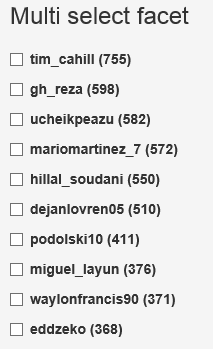

**The project includes a number of widgets (directives) building upon the [ElasticUI components][1] for simple faceting and search.
Try them out in the [demo][2].**

Reviewing how they work is a good way to get started with the project.

You don't have to use these widgets or create your own directives to get started with your own front-end. 
Instead, you can **directly use the base [components][1]** in your front-end. 
I.e.: directly copy the _"raw equivalent"_ code below in your HTML, and edit markup there.

euiSearchbox
---
A searchbox which performs a MatchQuery on the specified field.

*Example (using widget directive):*

    <eui-searchbox field="'textField'"></eui-searchbox>

*Raw equivalent (using the ElasticUI components directly):*

Using this prebuilt widget would correspond to directly writing:

    <input type="text" eui-query="ejs.MatchQuery('textField', querystring)" ng-model="querystring" eui-enabled="querystring.length" />

euiChecklist
---
*Example (using widget directive):*

    <eui-checklist field="'facet_field'" size="5"></eui-checklist>

*Raw equivalent (using the ElasticUI components directly):*

Using this prebuilt widget would correspond to writing:

    <ul class="nav nav-list" eui-aggregation="ejs.TermsAggregation('facet_field').field('facet_field').size(5)">
        <li ng-repeat="bucket in aggResult.buckets">
            <label class="checkbox" eui-filter="ejs.TermsFilter(field, bucket.key)">
                <input type="checkbox" ng-model="filter.enabled">
                {{bucket.key}} ({{bucket.doc_count}})
            </label>
        </li>
    </ul>

*Screenshot:*

euiSimplePaging
---
Simple previous and next buttons to page through results.

*Example (using widget directive):*

    <eui-simple-paging></eui-simple-paging>

*Raw equivalent (using the ElasticUI components directly):*

Using this prebuilt widget would correspond to writing:

    <ul class="pager">
        <li ng-class="{disabled:indexVM.page <= 1}"><a href="" ng-click="indexVM.page=indexVM.page - 1">Previous</a></li>
        <li ng-class="{disabled:indexVM.pageCount <= indexVM.page}"><a href="" ng-click="indexVM.page=indexVM.page + 1">Next</a></li>
    </ul>

[1]: components.md
[2]: ../examples/demo/demo.html